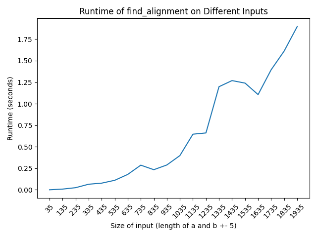

Students:
Hugo Liu - 46439406
Ethan Krol - XXXXXXXXXX

Main Functionality (Todo by Ethan)

- point to example input/output
- instructions on how to run the code (python ... file... etc)
- assumptions

### Question 1:

    Solved in runtime_graphs.py
    inputs generated using generate_files.py

    To generate 20 random files, with nontrivial, increasing input sizes for a and b, run in terminal:
    > python generate_files.py

    To graph the runtimes for generated 20 nontrivial inputs, run in terminal:
    > python runtime_graphs.py

    This will display and save the runtime of the graph into the graphs folder.

    Here is a generated graph

    

### Question 2:

    TODO by Ethan

### Question 3:

    The following pseudocode revolves around keeping 2 DP arrays
    One DP array is for keeping track of the highest values
    The other DP array is for keeping track of the LENGTH of the highest values

    Pseudocode:
    ```
    dp = [[0 for _ in range(len(a)+1)] for _ in range(len(b)+1)]
    dp_length = [[0 for _ in range(len(a)+1)] for _ in range(len(b)+1)]

    vals = [map of character to value]

    for j in range(1, len(dp)):
        for i in range(1, len(dp[j])):

            a_idx, b_idx = i-1, j-1

            if a[a_idx] == b[b_idx]:
                # If they match, we MUST take this path to get the value
                dp[j][i] = dp[j-1][i-1] + vals[a[a_idx]]
                dp_length[j][i] = dp_length[j-1][i-1] + 1
            else:
                # If they don't match, we inherit from the "heavier" neighbor
                if dp[j-1][i] >= dp[j][i-1]:
                    dp[j][i] = dp[j-1][i]
                    dp_length[j][i] = dp_length[j-1][i]
                else:
                    dp[j][i] = dp[j][i-1]
                    dp_length[j][i] = dp_length[j][i-1]

    return dp_length[-1][-1]

    ```

    The Big-Oh of this solution is O(n^2)
    This is because we are iterating through essentially a len(a)+1 by len(b)+1 matrix and performing constant time operations within those iterations,
    If we assume the size of b and a are defined by n, we can say it is O(n^2)

    Otherwise, we can say the Big-Oh is O(ab)
